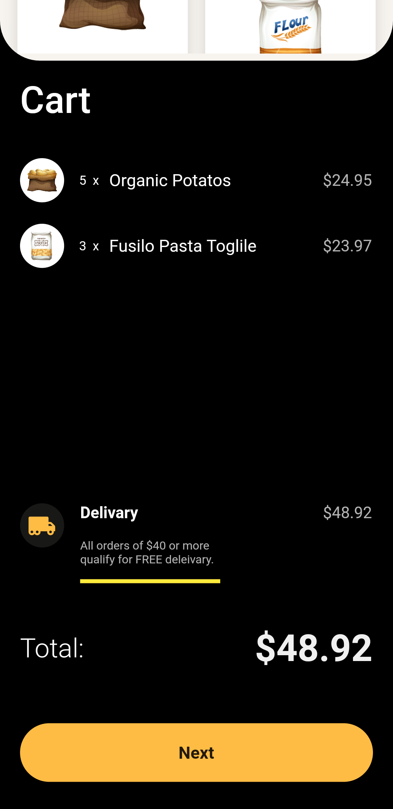
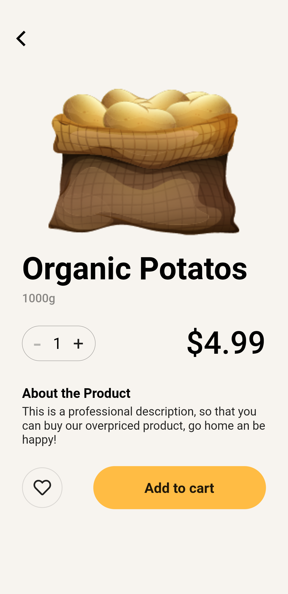
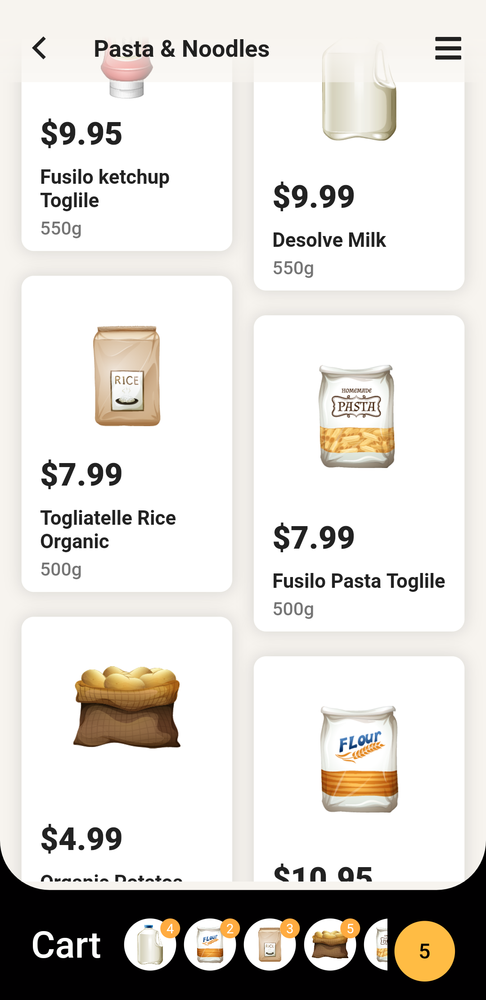
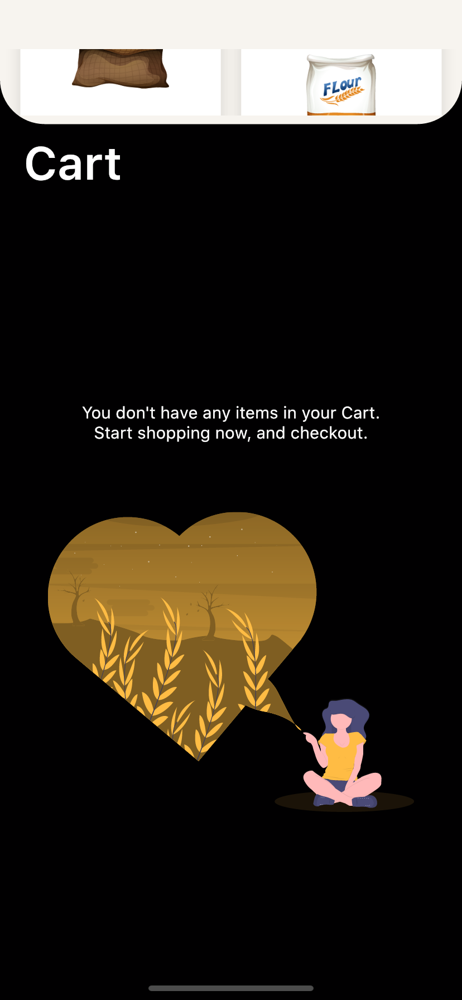
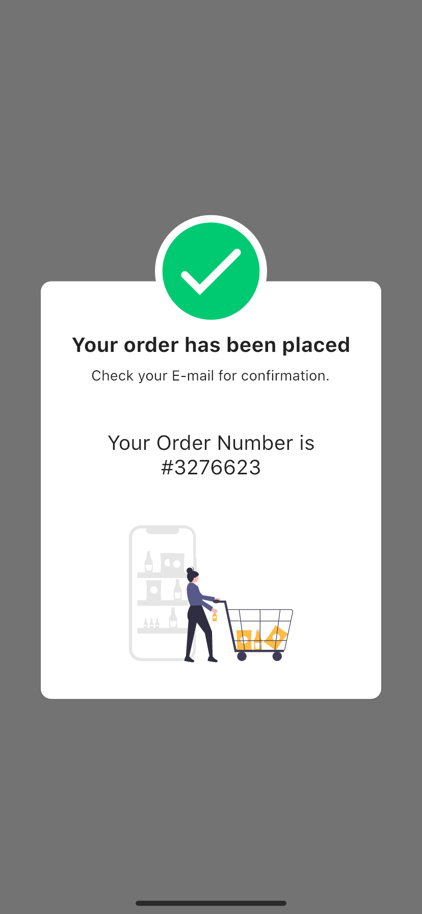

#  Shopping App

This amazing App UI is built on the amazing design of [Cuberto](https://dribbble.com/cuberto "Cuberto").

## Download App
<a href="https://github.com/AhmedAbouelkher/groceries-shopping-flutter-app/releases/download/1.0.1/Groceries.Shopping.apk"></img></a>

## Design
<!-- original_design.gif -->

## Implementation

     

       

    

## New and Better UI
 
